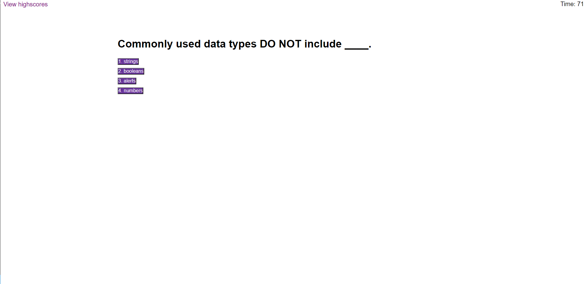

# code-quiz
This is a coding quiz that asks various questions \
and when the user gets a question wrong, the time \
decreases by 10 seconds. When the user finishes, \
the user inputs their initials and their score is \
how much time is left on the clock when they finish. \
When they input their initials, a local leaderboard \
shows up and they have the options to restart the quiz \
or clear the leaderboard.

https://justinean.github.io/code-quiz/